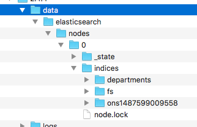

#DOCKER IMAGE
The document image is a simple extension of the Elastic Search image (current 2.4.4).

The onl difference is that the image now contains the Data from the ONS Website.

To rebuild the docker image you need to install ElasticSearch (ES) 2.4.4 (or what ever version you are going to use) and then run the indexing process, this is probably still Zebedee.

>If its Zebedee you can simple start up a new ES and the indices will be rebuild


Once you have built the indices with the data you want then copy the indices data files into the subdirectory `localData`.
Once the data has been copied then run docker  
```docker build -t guidof/onswebsite-search . ```
and this will create an image on your local docker repo.
```bash
fawkej$ docker images
\REPOSITORY                 TAG                 IMAGE ID            CREATED             SIZE
guidof/onswebsite-search   latest               253eeecee780        About an hour ago   1.05 GB
```

You probably want to tag it with a version number, say `0.0.2` to do this you need to use the `docker tag` command
```bash
docker tag 253eeecee780 guidof/onswebsite-search:0.0.2
```
> note the correlation between _IMAGE ID_ and the id after the `tag` command.

once you have a 0.0.2 locally you can then _(once you have logged into Docker)_ push the image into docker.
## Data files
You data files in Elastic will look like this 
.
Copy the `elasticsearch` directory, and all its children, to under the `localData` directory before building the image